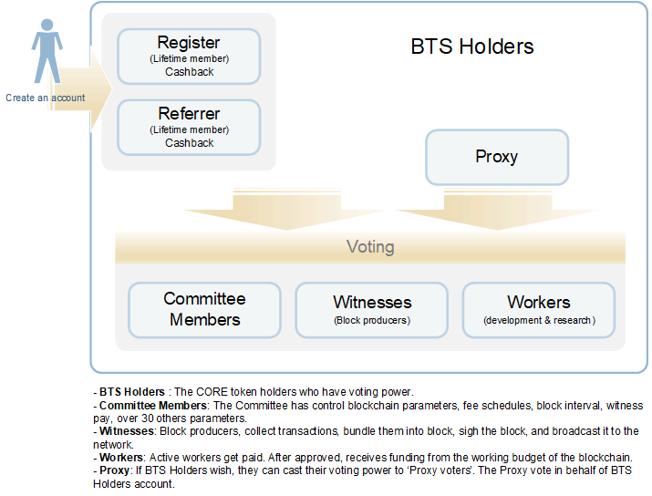
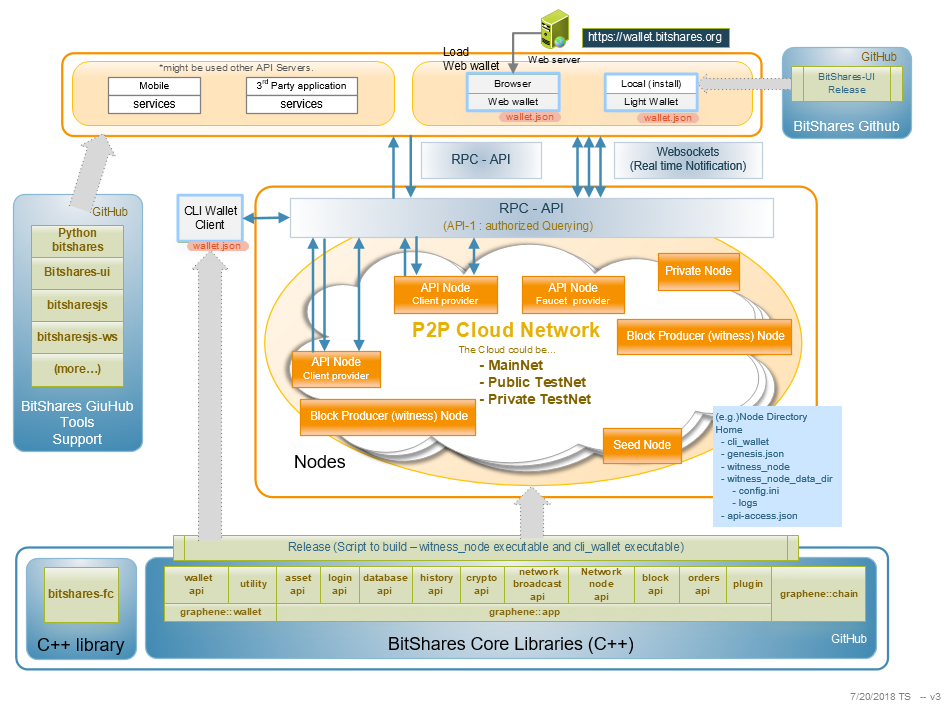

** 原文链接：https://dev.bitshares.works/en/master/intro/architectures.html

** 译者：Li Smith

** 校对者：

介绍与架构
==========

欢迎来到BitShares! 在这个章节, 我们将要研究BitShares的架构概述
(实体和结构), 以及核心团队如何处理开发工作.

如果开发人员有兴趣为Core团队做出贡献,
可以先查看贡献指南和GitFlow,看看Bitshares-Core团队是如何处理代码仓库文件和分支的。Core团队当前的项目、问题、软件发布计划，都可以在Bitshares
Core仓库的Issues和projects标签下找到。

内容列表
- [BitShares成员角色](#bitshares成员角色)
- [BitShares架构](#bitshares架构)
    - [GitHub仓库与实体](#github仓库与实体)
- [关键设计概念和特征](#关键设计概念和特征)
    - [设计的要点和基础:](#设计的要点和基础)
    - [BitShares可用特征](#bitshares可用特征)
- [交易和性能](#交易和性能)
    - [Bitshares区块浏览器](#bitshares区块浏览器)
    - [区块链活跃度](#区块链活跃度)

* * * * *

## BitShares成员角色
-----------------

如果你有个BitShares账号, 你是个BTS持有者,
可以在BitShares社区做出决定时有投票权. (阅读更多:
BitShares账户)

* * * * *

## BitShares架构
-------------

### GitHub仓库与实体

这是BitShares的架构概述图.
这个图的目的是将BitShares的主要元素组合在一起，展示了你能在BitShares的GitHub仓库中会发现什么类型的资源。

* * * * *

## 关键设计概念和特征
------------------

下图是BitShares的架构概述.
这个图的目的是将BitShares的主要元素组合在一起，展示了你能在BitShares的GitHub仓库中会发现什么类型的资源。

### 设计的要点和基础:

-   保持任何东西保存在内存中.
-   保持核心业务逻辑保留在一个单线程中.
-   保持加密操作（哈希和签名）在核心业务逻辑之外.
-   将验证分为状态依赖型检查和状态独立型检查。
-   使用面向对象的数据模型。
-   避免同步原语（锁，原子操作）。
-   尽量减少业务逻辑处理中的不必要计算。

BitShares的创建愿景是高性能区块链，且已完成从核心业务逻辑中，删除了所有非重要部分，顺序依赖的所有计算，去设计了一个协议以促进这些类型的优化。

### BitShares可用特征

BitShares可以同时定义为软件，网络，账本，银行，交易所，货币。（例如，它可以通过维护跟踪由其他资产抵押的债务的分布式账本，来履行银行的角色。你可以发现BitShares提供了许多其他流行的区块链平台没有的功能。）

-   **智能货币**
    是可同质互换的，可分割的，没有任何限制的。智能货币是一种加密货币，价值与另一种资产（如美元或黄金）锚定，智能货币实现了抵押货款的概念，并把它带到了区块链上。
-   **分布式交易所** -
    BitShares提供了高性能的分布式交易所，具有你在交易平台中所期望的所有功能。
    -   安全：所有的储备都作为BTS保留在区块链上，且无法被盗，因为没有可以被盗储备的私钥。
-   交易/金融服务
-   交易可指定账户名 (人性化的账户名)
-   全球唯一的账户名和ID.
-   动态账户权限
-   账户的多用户控制
-   两个权限: 账户和活跃密钥
-   交易 + 多签名权限
-   **可提议的交易基础设施**
    -   可以跟踪部分批准的交易
    -   它可以用来定期支付。
-   费用计算
    -   交易费
    -   收费表
-   资产 - **用户发行资产(UIA)**
    -   帮助促进某些类型服务的商业模式。.
    -   *用例* (活动门票, 奖励积分, 私有化智能货币, 预测市场, 等等).
    -   如何盈利（如费用池）
-   锚定资产 - bitUSD, bitEUR, bitCNY, 和其他.
-   **委托权益证明 (DPOS)**
    -   根据DPOS, BTS持有人具有影响力.
    -   强大而灵活的共识协议.
-   区块产生依赖于当选的见证人
-   **推荐计划** - 去激励人们带来更多的用户.
-   待解冻余额

* * * * *

## 交易和性能
----------

### Bitshares区块浏览器

BitShares区块浏览器展示BitShares区块链信息。你可以观察BitShares区块链\*健康\*状态（head\_block\_num,
head\_block\_age, chain\_id, 等等），交易如何处理，资产量和成员。

如果你想查看更多详细信息，Open
Explorer会提供其他信息选项卡（比如操作类型，代理人，市场，智能货币，用户发行资产，和持有者）以供查看。

-   [Cryptofresh](https://www.cryptofresh.com/)
-   [Open Explorer](http://open-explorer.io/)
-   [bts.ai](https://bts.ai/)

### 区块链活跃度

区块链活跃度矩阵展示了不同的通证（资产）\*活跃度\*, *价值*,
*指数*。一个有趣指标是检查CUI指数，即产能利用率指数（区块链日常活动数与每日区块链交易容量的比例），可用看看BitShares有多少利用率。

-   [Block'tivity](http://blocktivity.info/)
